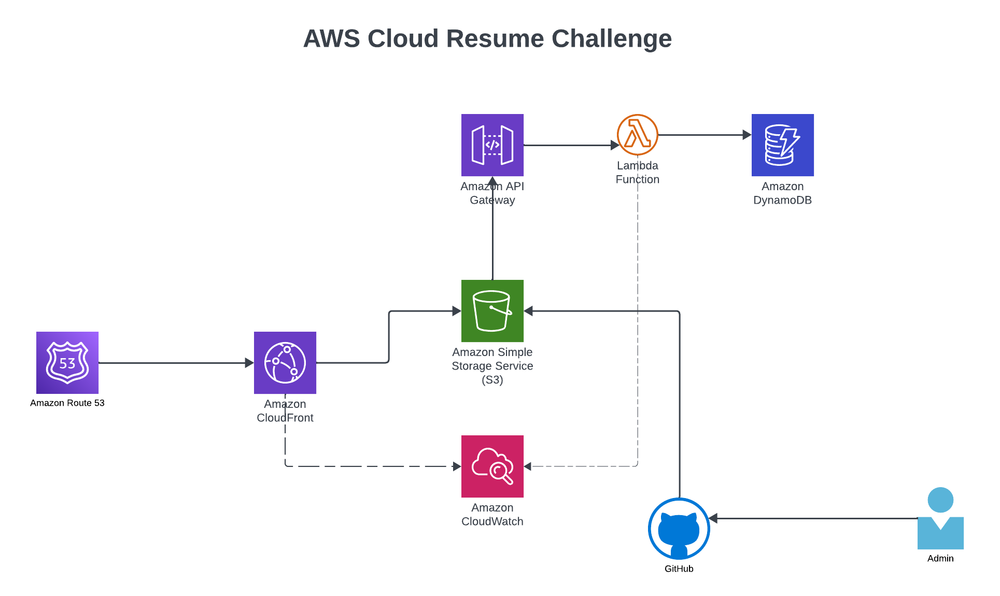

## Cloud Resume Challenge built on AWS Services. 

This is my attempt to build my online resume in AWS as part of the Cloud Resume Challenge defined by  <a href="https://cloudresumechallenge.dev/docs/the-challenge/aws/" target="_blank">  Forrest Brazeal</a> 

## Project Highlights

* <a href="https://www.seshadri-resume.net/index.html" target="_blank"> My Resume </a>
* Built HTML/CSS page resume and hosted it as a S3 static website
* Setup github repo and github actions to define CI/CD pipeline
* Author a lambda function to calculate the page visits and store in dynamodb
* Registered domain in route53 and configured cloudfront 
* API gateway to trigger the lambda function 
* Python lambda function to increment page visit counter and store in dynamodb

## Architecture

## AWS Services 

1. S3 Static Website
2. Route53
3. CloudFront
4. DynamoDB
5. Lambda
6. API Gateway
7. CloudWatch

## Lessons Learnt

* Various AWS services
* Registering a domain in route53 and creating managing SSL certificates using ACM
* Creating Github actions, defining secrets and configure manual and automated workflows
* Configuring API gateway and Cloudfront 
* Configure CloudWatch logs for requests to my page

## Next Steps (as time permits)

* Use Azure and GCP services
* Use IAC to automate infra deployment

# Author
* Seshadri Vasudevan
